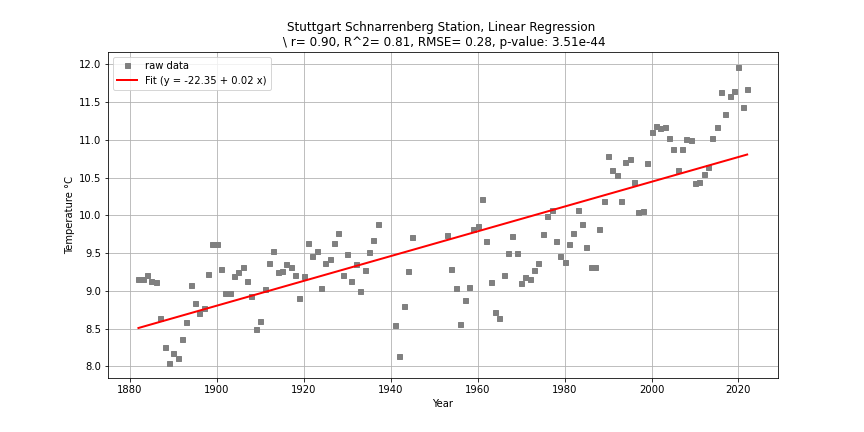

# Data-Visualisation
Data visualisation using Matplotlib and other relevant packages

data source:
https://data.giss.nasa.gov/cgi-bin/gistemp/stdata_show_v4.cgi?id=GME00115771&ds=14&dt=1

Outputs:

